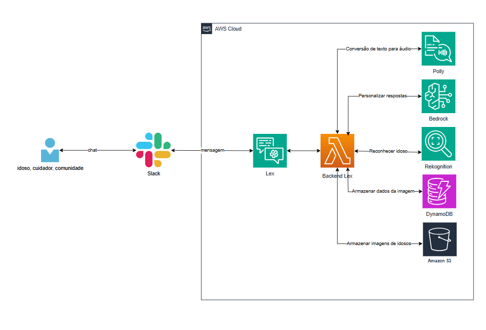
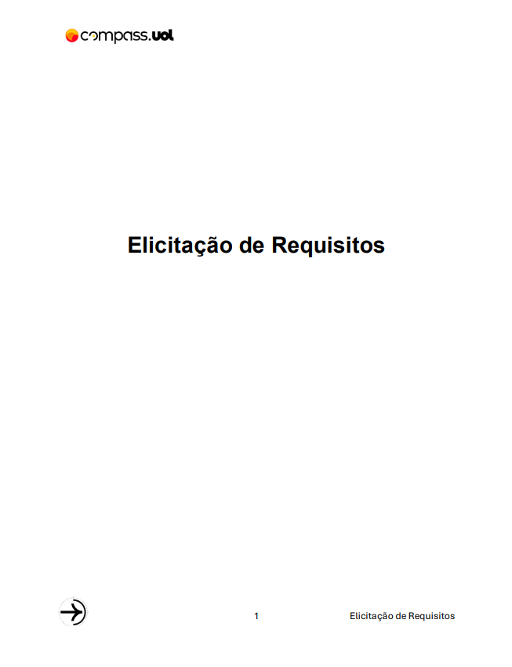
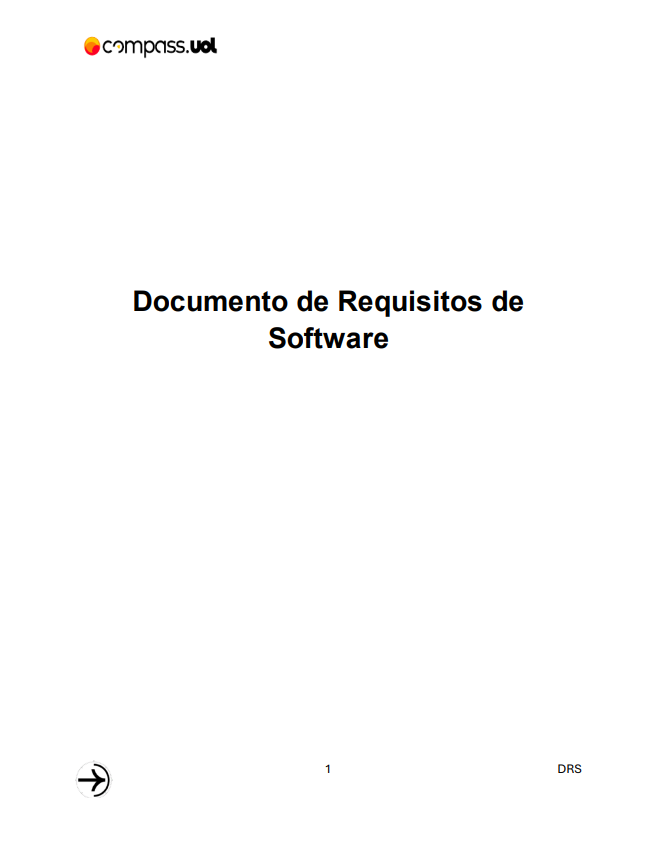
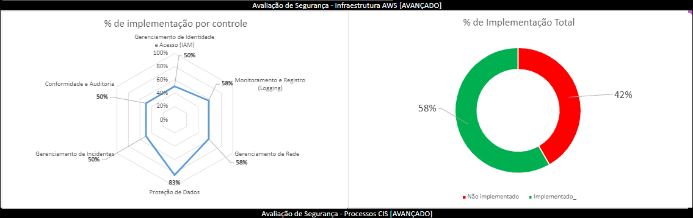

# 🤖👴 Projeto de Chatbot para o Lar Cuidar

## 🌍 Visão Geral

Este projeto tem como objetivo desenvolver uma aplicação acessível e útil para o lar de idosos "Lar Cuidar Família Santos" (LACFAS), localizado no Sítio Quebra-Pé, Esperança, PB. O LACFAS é uma organização sem fins lucrativos dedicada a acolher idosos a partir dos 60 anos, oferecendo assistência e cuidados adequados a essa faixa etária. A instituição segue as diretrizes da Política Nacional de Assistência Social, garantindo proteção integral, moradia, alimentação, e higiene para indivíduos que estão sem referência ou em situação de ameaça, violência, negligência ou abandono.

O foco principal deste projeto é criar um chatbot que servirá como um portal de comunicação e interação tanto para os idosos residentes quanto para seus cuidadores e familiares. Através do chatbot, os usuários poderão obter informações sobre as atividades do dia, como fisioterapia, palestras, atividades físicas, artes, crochê, bordado e outras atividades artesanais. Além disso, o chatbot permitirá solicitar ajuda e contribuir para a busca de idosos desaparecidos, enviando fotos que serão comparadas com uma base de dados interna.

## 📖 Índice

1. [🚀 Funcionalidades](#-funcionalidades)
2. [🏛️ Arquitetura](#️-arquitetura)
3. [🔄 Fluxo de Interação](#-fluxo-de-interação)
4. [🛠️ Tecnologias utilizadas](#️-tecnologias-utilizadas)
5. [📝 Documentos](#️-documentos)
6. [🧱 Estrutura de Pastas](#-estrutura-de-pastas)
7. [👥 Contribuidores](#-contribuidores)


## 🚀 Funcionalidades

- Saber as atividades que irão acontecer em determinado dia no lar;
- Realizar uma doação via pix ou de alimentos e itens;
- Se cadastrar como voluntário para ajudar o lar em atividades;
- Cadastrar idosos que querem receber uma visita em sua casa.

## 🏛️ Arquitetura



A arquitetura do projeto faz uso de vários serviços da AWS para garantir uma experiência de usuário fluida e funcional:

- **Amazon Lex**: Usado como o motor principal do chatbot, responsável por processar as mensagens dos usuários e determinar as intenções.
- **AWS Lambda**: Função backend que processa as requisições do Lex e interage com outros serviços AWS para fornecer as respostas e ações necessárias.
- **Amazon Polly**: Proporciona acessibilidade ao converter respostas de texto em áudio, especialmente útil para idosos com dificuldades de leitura.
- **Amazon Rekognition**: Utilizado para receber fotos de comprovantes de transferências Pix e validar informações.
- **Amazon Bedrock**: Integração com modelos de linguagem avançados para personalizar e contextualizar as respostas do chatbot, melhorando a interação com os usuários.
- **Amazon S3**: Armazena os áudios gerados pela API com Polly.
- **Amazon DynamoDB**: Armazena hashcode único dos áudios gerados pela API com o Polly e, em outra tabela, dados do cadastro de voluntários.

## 🔄 Fluxo de Interação

1. **Usuários (idosos, cuidadores, comunidade)**: Enviam mensagens, fotos ou áudios através do canal de comunicação Slack.
2. **Slack**: Recebe as mensagens dos usuários e as repassa para o Amazon Lex.
3. **Amazon Lex**: Processa a mensagem, identifica a intenção e encaminha a solicitação para a função Lambda apropriada.
4. **AWS Lambda**: Executa as ações necessárias, como chamar o Bedrock para personalizar respostas, ou o Rekognition para comparar imagens.
5. **Amazon Polly**: Converte as respostas textuais em áudio, retornando ao Slack para que o usuário final possa ouvir as informações.
6. **Amazon S3**: Armazena áudios do Polly.
7. **Amazon DynamoDB**: Armazena hashcode dos áudios e também dados da intent de cadastro de idosos e de voluntários.

## 🛠 Tecnologias Utilizadas

<div>
  
  
  
   
  
  
  
  
    
  
  

</div>

## 📝 Documentos 

  <div style="display: flex; justify-content: space-between;">
    <a href="assets/Elicitação de Requisitos.pdf">
      
    </a>
    <a href="assets/Documento de Requisitos de Software - DRS.pdf">
      
    </a>
  </div>

  <a href="assets/Avaliação de Segurança - LACFAS(Infraestrutura AWS).csv">
    
  </a>


## 🧱 Estrutura de Pastas 

- `api/`: Handlers e configuração do Serverless para a API.
- `assets/`: Imagens e recursos visuais.
- `bot/LACFASBot-DRAFT-WU0CVSFFHU-LexJson/`: Bot do Lex com suas Intents e Slots.
- `infra/`: Infraestrutura da VPC.
- `server/`: Servidor e Lambda.

```
│
├── api/
|   ├── utils/
|       ├── convert_text_to_speech.py
|       ├── creat_bucketS3.py
|       ├── create_dynamoDB.py
|       └── summarize_text.py
│   ├── .env.example
│   ├── handler.py
│   ├── package-lock.json
│   ├── package.json
|   ├── post.py
|   ├── requirements.txt
|   ├── serverless.yml
|   ├── slackHandler.py
|   └── post.py
│
├── assets/
│   └── arquitetura.png
│
├── bot/LACFASBot-DRAFT-WU0CVSFFHU-LexJson/
│   ├── LACFAS/
│   │   ├──  BotLocales/pt_BR/
│   │       ├── Intents/
│   │       ├── SlotTypes/
│   │       └── BotLocale.json
│   │   └── Bot.json
│   └── Manifest.json
│
├── infra/
│   ├── README.md
│   ├── main.tf
│   ├── terraform.tfvars
│   └── variables.tf
│
├── server/
│   ├── lambda/
│       ├──  controllers/
│           ├── atividadesDia.js
│           ├── cadastro.js
│           ├── cadastroVoluntario.js
│           ├── doacao.js
│           ├── escolherCadastro.js
│           ├── fallback.js
│           ├── saudacao.js
│           └── visitas.js
│       ├──  lib/
│           └── api.js
│       ├──  utils/
│           ├── analyze-image.js
│           ├── generate-tts.js
│           ├── response-builder.js
│           └── validations.js
│       └──  index.js
│   ├── .env.example
│   ├── package-lock.json
│   ├── package.json
│   └── server.js
│
└── README.md

```
   
## 👥 Contribuidores
<table>
  <tr>
    <td align="center">
      <a href="https://github.com/estertrvs" title="GitHub">
        <br>
        <sub>
          <b>Ester Trevisan</b>
        </sub>
      </a>
    </td>
    <td align="center">
      <a href="https://github.com/emanuelleGued" title="GitHub">
        <br>
        <sub>
          <b>Emanuelle Guedes</b>
        </sub>
      </a>
    </td>
    <td align="center">
      <a href="https://github.com/https-Luan-Fernandes" title="GitHub">
        <br>
        <sub>
          <b>Luan Fernandes</b>
        </sub>
      </a>
    </td>
    <td align="center">
      <a href="https://github.com/LuizManoeldev" title="GitHub">
        <br>
        <sub>
          <b>Luiz Manoel</b>
        </sub>
      </a>
    </td>
    <td align="center">
      <a href="https://github.com/SilasLeao" title="GitHub">
        <br>
        <sub>
          <b>Silas Leão</b>
        </sub>
      </a>
    </td>
  </tr>
</table>
